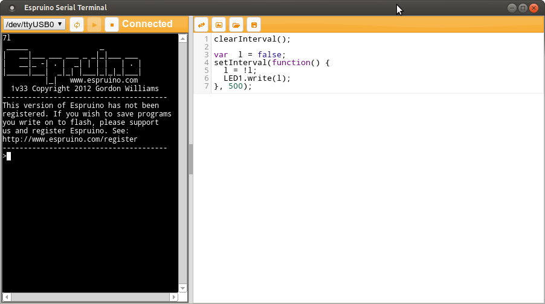
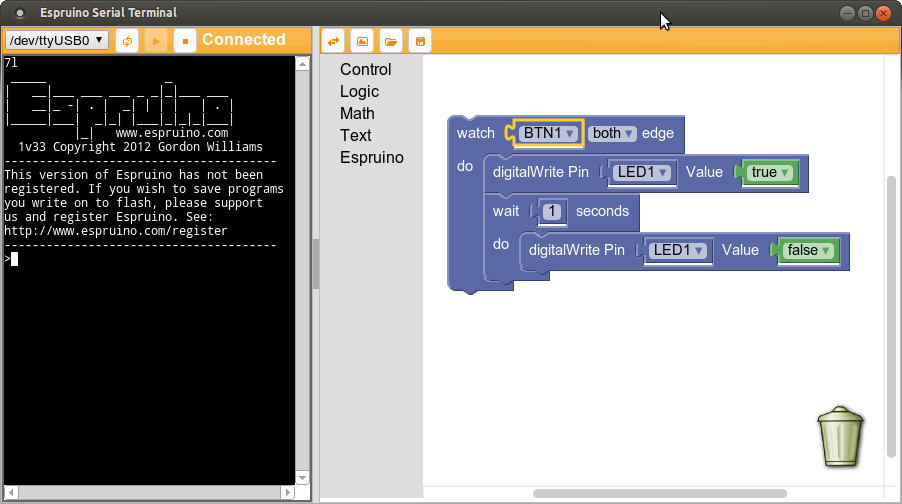

Espruino Web IDE  [](https://gitter.im/espruino/Espruino?utm_source=badge&utm_medium=badge&utm_campaign=pr-badge&utm_content=badge)
======================

A VT100 Serial Terminal [as a Web App](https://espruino.com/ide) (with both syntax highlighted and graphical editors) - designed for writing code on microcontrollers that use the [Espruino JavaScript interpreter](http://www.espruino.com). It can also run natively via [Node.js](https://nodejs.org/en/) and [Electron](http://electron.atom.io/), or a version

[](http://youtu.be/Fjju_QhzL-c)
[](http://youtu.be/Fjju_QhzL-c)


This is a Chrome Web App ([mainly](#full-web-version)) that uses [chome.serial](https://developer.chrome.com/apps/serial) to access your PC's serial port. You can download it from the Chrome Web Store: https://chrome.google.com/webstore/detail/espruino-serial-terminal/bleoifhkdalbjfbobjackfdifdneehpo

It implements basic VT100 terminal features (up/down/left/right/etc) - enough for you to write code using the Espruino. You can also use the right-hand pane to write JavaScript code on the PC, and can then click the 'transfer' icon to send that code directly down the Serial Port.

| Version | Communications | Benefits |
|---------|----------------|----------|
| [Web Version](#full-web-version) | [Audio](http://www.espruino.com/Headphone), Bluetooth Low Energy (via [Web Bluetooth](https://webbluetoothcg.github.io/web-bluetooth/)) and USB/Serial via WebSerial | **RECOMMENDED** - Just go to [a URL](https://espruino.github.io/EspruinoWebIDE/) |
| [Chrome Web App](#installing-from-chrome-web-store) | USB, Serial, [Audio](http://www.espruino.com/Headphone), TCP/IP | Easy to install from [Chrome Web Store](https://chrome.google.com/webstore/detail/espruino-serial-terminal/bleoifhkdalbjfbobjackfdifdneehpo) - but Google are deprecating the web store |
| [Node.js App](#installing-from-npm) / NW.js app | USB, Serial, Bluetooth Low Energy | Can be run on systems without Chrome web browser |


The development of this app is supported by [purchases of official Espruino boards](http://www.espruino.com/Order) as well as the generous donations of my supporters on [Patreon](PATREON.md)


Running online
---------------

This is how we'd recommend using the IDE. You can use:

* Our hosted IDE: https://espruino.com/ide
* 'master' branch hosted on GitHub Pages: https://espruino.github.io/EspruinoWebIDE/
* Or your own fork of this repository running on any HTTPS Server (eg GitHub Pages)
    * If you want to run your fork locally, see [`Installing from GitHub`](#installing-from-github-latest-version) in this readme.


### URL options

When running online, you can pass various options on the url:

* `?code=....` set the contents of the editor to the given code value
* `?codeurl=https://...` set the contents of the editor to the code at the given URL
* `?gist=1234...` set the contents of the editor to the code in the gist at https://gist.github.com/
* `?upload` attempt to upload the code (specified above) immediately
* `?dev=Bangle.js 1234` when connecting, only offer Web Bluetooth, and filter the devices using the given `namePrefix`
* `?settings={"MINIFICATION_LEVEL":"ESPRIMA"}` apply the given configuration changes specified as JSON (prompts the user!)


Installing From Chrome Web Store
----------------------------

This is deprecated by Google and may be removed soon:

* Install the [Chrome Web Browser](https://www.google.com/intl/en/chrome/browser/)
* [Go Here](https://chrome.google.com/webstore/detail/espruino-serial-terminal/bleoifhkdalbjfbobjackfdifdneehpo) to find the app in the Chrome Web Store
* Click 'Install'
* Click 'Launch App'

Installing from NPM
-------------------

If you have an up to date version of [Node.js](https://nodejs.org/en/) and [NPM](https://www.npmjs.com/), you can execute the commands:

* On Linux, `sudo apt-get install build-essential libudev-dev`
* `sudo npm install nw -g`
* `sudo npm install espruino-web-ide -g`
* To enable BLE support: `sudo setcap cap_net_raw+eip $(eval readlink -f $(which node))`
* `espruino-web-ide`

**Note:** For command-line access you might also want to take a look at [EspruinoTools](https://github.com/espruino/EspruinoTools)

**Note 2:** If you're not seeing any options for devices to connect to, it might be because your `nw.js` and node versions don't match. If that's the case you need to manually rebuild all the 'native' modules.

```
npm install -g nw-gyp
# Now, for directory in node_modules with a binding.gyp file...
# target should match the nw.js version in node_modules/nw/package.json
nw-gyp rebuild --target=0.18.6 --arch=x64
```

Installing from GitHub (Latest Version)
---------------------------------------

You need to obtain both the EspruinoWebIDE repository and the EspruinoTools repository, a submodule used in the Web IDE.
A simple way to obtain both repositories is via the git command:

```git clone --recursive https://github.com/espruino/EspruinoWebIDE.git```

This will clone both the EspruinoWebIDE repository and the submodule dependencies. Alternatively, you can download or clone both repositories individually following the steps below:

* Download the files in [EspruinoWebIDE](https://github.com/espruino/EspruinoWebIDE) to an `EspruinoWebIDE` directory on your PC (either as a [ZIP File](https://github.com/espruino/EspruinoWebIDE/archive/gh-pages.zip), or using git)
* Download the files in [EspruinoTools](https://github.com/espruino/EspruinoTools) into the `EspruinoWebIDE/EspruinoTools` on your PC (either as a [ZIP File](https://github.com/espruino/EspruinoTools/archive/gh-pages.zip), or using git)

### Running in [Node.js](https://nodejs.org/en/) as a website (recommended)

This is the version that is also available at https://espruino.com/ide

* Go to the `EspruinoWebIDE` directory
* Run `npm install`
* Run `npm run web`
* Open the link written in your terminal, it will look something like `http://localhost:3000`

### Running in [Node.js](https://nodejs.org/en/) as an application

This version is no longer maintained.

* Go to the `EspruinoWebIDE` directory
* Run `sudo npm install nw -g`
* Run `npm install`
* Run `npm start`


Chrome Permissions
------------------

This web app requires the following permissions:
* *Serial port access* : So that it can access the Espruino board via USB/Serial
* *Webcam access* : So that when you click the little person icon in the top-right of the terminal window, you can overlay the terminal on a live video feed
* *Audio access*: if you want to [communicate with Espruino using your headphone jack](http://www.espruino.com/Headphone)
* *Filesystem/storage access* : For loading/saving your JavaScript files to your local disk


Using
-----

* Run the Web app
* Click the `Help` (?) icon, then the `Tour` button to get a guided tour.

**Running with Node.js/Electron and don't see any ports when you try and connect?** You're probably using a version of Node.js that doesn't match Electron. This causes NPM to load binary modules (for `serialport` and `bleat`) that are for the old version of Node and that won't work in Electron. To fix it, update Node.js, delete `node_modules` and run `npm install` again.

**Debugging with NW** In order to debug the WebIDE using DevTools you need to install the SDK flavor of nw. This can be done with `npm install -g nw --nwjs_build_type=sdk` instead of just `npm install -g nw`. Once the SDK flavor is installed you can specify a remote-debug port like this `nw --remote-debugging-port=9222 `.


Contributing
------------

Contributions are welcome - especially if they make the Web IDE easier to use for newcomers!

### Getting Started

Espruino Web IDE expects the [EspruinoTools](https://github.com/espruino/EspruinoTools) repository to be in `EspruinoWebIDE/EspruinoTools`. If you're using Git, make sure you add it using the command:

```
git submodule add git@github.com:espruino/EspruinoTools.git
```

### Code Style

 * Please stick to a [K&R style](http://en.wikipedia.org/wiki/1_true_brace_style#K.26R_style) with no tabs and 2 spaces per indent
 * Filenames should start with a lowerCase letter, and different words should be capitalised, not split with underscores

### Code Outline

 * Core functionality goes in `js/core`, Plugins go in `js/plugins`. See `plugins/_examplePlugin.js` for an example layout
 * Plugins/core need to implement in init function, which is called when the document (and settings) have loaded.
 * Plugins can respond to specific events using `Espruino.addProcessor`. For instance you can use `Espruino.addProcessor("transformForEspruino", function (data,callback) { .. })` and can modify code before it is sent to Espruino.
 * Icons are added using `Espruino.Core.App.addIcon` and are generally added from JsvaScript file that performs the operation
 * Config is stored in `Espruino.Config.FOO` and is changed with `Espruino.Config.set("FOO", value)`. `Espruino.Core.Config.add` can be used to add an option to the Settings menu.
 * Annoyingly, right now plugins still have to be loaded via a `<script>` tag in `main.html`
